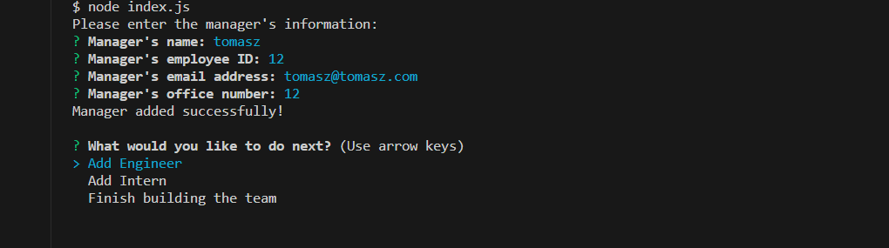
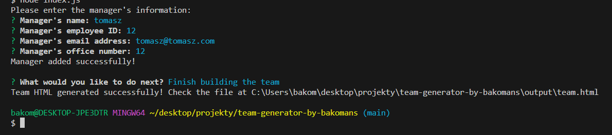

# team-generator-by-bakomans

# Team Generator

This command-line application is designed to help managers generate a webpage that displays their team's basic information. The application accepts user input to gather details about the team members, such as the manager, engineers, and interns. The generated webpage includes a list of employee names, titles, and key information.

The project includes the following classes:

### Employee Class
- Properties: name, id, email
- Methods: getName(), getId(), getEmail(), getRole()

### Manager Class (extends Employee)
- Additional Property: officeNumber
- Method: getRole() (overridden to return 'Manager')

### Engineer Class (extends Employee)
- Additional Property: github (GitHub username)
- Methods: getGithub(), getRole() (overridden to return 'Engineer')

### Intern Class (extends Employee)
- Additional Property: school
- Methods: getSchool(), getRole() (overridden to return 'Intern')

The application uses Jest for unit testing, Inquirer for user input, and ESM for ES module support. It follows the given User Story and Acceptance Criteria to ensure the proper functioning of the Team Generator.

## Features

- Creates a webpage with team members' information.
- Supports the addition of managers, engineers, and interns.
- Uses Inquirer for user input and Jest for testing.
- Generates an HTML file for the team.

## Usage

To use this application, follow these steps:

1. Install dependencies: `npm install`
2. Run the application: `npm start`
3. Follow the prompts to enter information about the team members.
4. Select the option to finish building the team when done.
5. The application will generate an HTML file in the `output` folder.

## License

This project is licensed under the MIT License.
## Photos



## Testing

Run tests using the following command:

```bash
npm test

